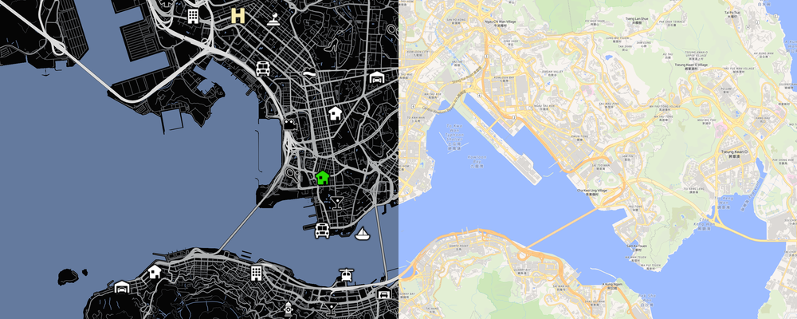

# 🗺️ GTA 5 Map Style Skill



中文 | [English](README_en.md) | [地图示例](example.md)

将任意真实城市导出为 GTA 5 地图风格的 3000×3000 PNG。地图使用 OpenFreeMap 与 OpenStreetMap 数据，隐藏道路名称、行政区名称和普通地点文字，以黑色地面、灰白分级道路、低饱和蓝色水域和 GTA 5 地点图标呈现城市。

本项目是一个可发布到 GitHub，并可安装到 Codex、Claude Code 和 WorkBuddy 的 Agent Skill。主技能使用通用 `SKILL.md` 结构，各平台只在安装位置、显式调用语法和分发方式上有所不同。

## ✨ 主要能力

- 输入任意城市名称生成真实城市地图。
- 支持“香港九龙主要城区”“香港湾仔区”“以维多利亚港为中心”等自然语言范围描述。
- 支持用自然语言指定最小和最大画面跨度，由 Agent 在两者之间选择合适范围。
- 支持用自然语言要求同时导出 OpenFreeMap 官方 Liberty 样式原图，作为与 GTA 成品完全同范围的对照图。
- 输出严格为 3000×3000 PNG，不添加城市标题、GTA 标志或地图文字。
- 使用 GTA 5 风格地点图标标记警察、医院、机场、火车站、酒吧、车辆修理厂、银行、枪店、赌场、赛车场、码头、直升机坪等真实地点。
- 地点图标采用稳定稀疏布局，避免大量图标重叠；相同城市和种子可复现相同布局。

## 🧰 运行环境

- Codex、Claude Code，或能够运行自定义技能脚本的 WorkBuddy、Doubao Work 环境。
- Node.js 20 或更高版本。
- Google Chrome。
- 可以访问 OpenFreeMap、Nominatim 和 Overpass 服务的网络环境。

安装依赖：

```bash
npm ci --omit=dev
```

## 💻 在 Codex 中安装

### 📦 使用 Skill Installer

在 Codex 中输入：

```text
$skill-installer 从 https://github.com/linconz/gtamapstyle 安装 gta5-map-style
```

安装完成后，如果技能没有立即出现，重新启动 Codex。

### 👤 个人级安装

个人级技能可以在所有项目中使用：

```bash
git clone https://github.com/linconz/gtamapstyle.git "$HOME/.agents/skills/gta5-map-style"
npm --prefix "$HOME/.agents/skills/gta5-map-style" ci --omit=dev
```

### 🗂️ 项目级安装

在目标 Git 仓库根目录执行：

```bash
mkdir -p .agents/skills
git submodule add https://github.com/linconz/gtamapstyle.git .agents/skills/gta5-map-style
npm --prefix .agents/skills/gta5-map-style ci --omit=dev
```

项目级安装会让该仓库中的其他使用者也能发现这个技能。Codex 会从当前目录向仓库根目录扫描 `.agents/skills`。

Codex 的显式调用以 `$` 开头：

```text
$gta5-map-style 生成香港地图
```

## 🧠 在 Claude Code 中安装和使用

Claude Code 会读取个人目录或项目目录中的技能，目录名 `gta5-map-style` 同时也是斜杠命令名。详见 [Claude Code 官方 Skills 文档](https://code.claude.com/docs/en/slash-commands)。

### 👤 个人级安装

安装后可在所有 Claude Code 项目中使用：

```bash
git clone https://github.com/linconz/gtamapstyle.git "$HOME/.claude/skills/gta5-map-style"
npm --prefix "$HOME/.claude/skills/gta5-map-style" ci --omit=dev
```

### 🗂️ 项目级安装

在目标 Git 仓库根目录执行：

```bash
mkdir -p .claude/skills
git submodule add https://github.com/linconz/gtamapstyle.git .claude/skills/gta5-map-style
npm --prefix .claude/skills/gta5-map-style ci --omit=dev
```

在 Claude Code 中显式调用：

```text
/gta5-map-style 生成香港地图
```

也可以直接说“生成香港的 GTA 5 风格地图”，让 Claude 根据技能描述自动调用。

## 🛠️ 在 WorkBuddy 中安装和使用

WorkBuddy 的自定义技能通过 ZIP 上传。每个 GitHub Release 都提供已经打包并验证完成的安装包，符合 WorkBuddy `skills/<skill-name>/SKILL.md` 结构，并包含中英文名称、描述、版本、作者和工具权限元数据。结构要求详见 [WorkBuddy 官方技能文档](https://open.workbuddy.cn/docs/skill)。

[下载最新版 WorkBuddy 安装包](https://github.com/linconz/gtamapstyle/releases/latest/download/gta5-map-style-workbuddy.zip)

安装步骤：

1. 下载 `gta5-map-style-workbuddy.zip`，不要解压。
2. 在 WorkBuddy 开放平台选择“Add Skill”，再选择“Create Skill”。
3. 上传下载好的 ZIP 并完成安装。

不需要克隆仓库或自行执行打包命令。技能发布到市场后，其他用户也可以在 WorkBuddy 左侧“专家·技能·连接器”的技能页面中安装。

在 WorkBuddy 对话中使用自然语言点名技能即可：

```text
请使用 gta5-map-style 技能生成香港九龙及港岛北岸的 GTA 5 风格地图，并同时导出同范围的 OFM 原图。
```

WorkBuddy 的执行环境仍需提供 Node.js 20+、npm、Google Chrome 和可访问地图服务的网络。技能首次运行时会自动安装锁定版本的依赖。

## 🔄 跨平台使用技能

自然语言是通用调用方式，不依赖某个 Agent 的命令语法：

```text
请使用已安装的 gta5-map-style 技能，生成一张巴黎的 GTA 5 风格地图，输出为 3000×3000 PNG。
```

各平台的显式或推荐写法如下：

| Agent | 调用方式 |
|---|---|
| Codex | `$gta5-map-style 生成香港地图` |
| Claude Code | `/gta5-map-style 生成香港地图` |
| WorkBuddy | `请使用 gta5-map-style 技能生成香港地图` |
| 其他兼容 Agent Skills 的 Agent | 使用自然语言点名 `gta5-map-style`，或按该 Agent 自己的技能命令语法调用 |

技能也允许隐式调用。只要清楚描述 GTA 5 风格城市地图，支持自动技能匹配的 Agent 就可以选择该技能：

```text
生成一张巴黎的 GTA 5 风格地图，输出为 3000×3000 PNG。
```

城市存在重名时，补充省份、州或国家：

```text
生成英国伦敦的 GTA 5 风格地图。
```

默认文件保存在当前工作区的：

```text
outputs/<city>-gta5-map-3000.png
```

如果要求同时导出 OFM 原图，默认会在同一目录生成：

```text
outputs/<city>-gta5-map-3000-ofm-original.png
```

## 🗣️ 用自然语言控制地图范围

### 🌆 整座城市

```text
生成东京地图，选择能够完整表现中心城区的适中范围。
```

### 🔁 核心城区

```text
生成香港地图，范围控制在九龙及港岛北岸主要城区。
```

Agent 会根据指定的核心城区确定地图中心和画面跨度，并尽量完整覆盖主要道路与海岸线。

### 🏙️ 指定行政区或城区

```text
生成香港湾仔区的 GTA 5 风格地图，只表现湾仔区及其主要道路。
```

```text
生成纽约曼哈顿区域的 GTA 5 风格地图。
```

多个行政区可以用顿号或分号列出，Agent 会使用正式行政区名称并取联合边界：

```text
重新生成香港地图，范围固定在深水埗、黄大仙、观塘、九龙城、油尖旺、中西、湾仔、东区。
```

### 📍 以地标为中心

```text
生成巴黎地图，以埃菲尔铁塔为中心，覆盖周边主要城区。
```

```text
生成香港地图，以维多利亚港为中心，画面跨度控制在 20 至 30 公里。
```

### 📏 同时指定最小和最大范围

```text
生成香港地图，画面范围不要小于 20 公里，也不要超过 45 公里，在两者之间取适中的范围。
```

这里的公里数表示成品画面的实际地理跨度，不是地图缩放级别。

### 🎲 指定另一套可复现布局

```text
重新生成香港九龙及港岛北岸地图，使用种子“hong-kong-night”，换一套地点图标布局，并保证以后可以复现。
```

### 📁 指定输出位置

```text
生成香港中心城区的 GTA 5 风格地图，保存到当前项目的 artwork/hong-kong-map.png。
```

### 🌓 同时导出相同区域的 OFM 原图

```text
生成首尔的 GTA 5 风格地图，同时截取完全相同范围、相同尺寸的 OFM 原图用于对照。
```

也可以分别指定两张图的位置：

```text
生成香港九龙及港岛北岸的 GTA 5 风格地图，同时导出同范围 OFM 原图。GTA 地图保存到 outputs/hong-kong-gta5.png，OFM 原图保存到 outputs/hong-kong-ofm.png。
```

两张图会共用同一中心点和缩放级别，均先以 3256×3256 渲染，再从四周各裁切 128 像素，最终严格为 3000×3000。裁切后的图片不包含右下角底部提示。

### ✅ 完整示例

```text
生成香港九龙及港岛北岸的 GTA 5 风格地图。画面跨度至少 20 公里、最多 35 公里，在这个区间选择适中的范围。保留真实机场、火车站、医院、警察、酒吧、车辆服务、枪店、赌场、赛车场和其他 GTA 活动图标。输出严格为 3000×3000 PNG，保存到 outputs/hong-kong-urban-core.png。
```

## 🧠 Agent 如何理解请求

| 自然语言信息 | Agent 使用方式 |
|---|---|
| “香港” | 解析城市中心和城市边界 |
| “九龙及港岛北岸” | 作为优先城区范围解析 |
| “湾仔区” | 作为行政区范围解析 |
| “以维多利亚港为中心” | 以地标定位结果确定画面中心 |
| “最少 20 公里，最多 40 公里” | 设置允许的最小和最大画面跨度 |
| “使用种子 night” | 生成另一套可复现的地点选择 |
| “保存到 artwork/map.png” | 使用指定输出路径 |
| “同时导出同范围 OFM 原图” | 添加官方 Liberty 样式对照图，并复用 GTA 地图的中心、缩放与裁切 |
| “OFM 原图保存到 outputs/original.png” | 为对照图使用指定输出路径 |

如果用户没有提供城市，Agent 会先询问城市名称。城市存在重名且无法唯一确定时，Agent 会要求补充省份、州或国家。

## ⚙️ 直接运行导出脚本

不通过 Agent 时，也可以直接执行底层脚本：

```bash
node scripts/export-city-map.mjs \
  --city "香港" \
  --scope "九龙、香港岛北岸" \
  --min-range-km 20 \
  --max-range-km 35 \
  --output "$PWD/outputs/hong-kong-urban-core.png" \
  --include-ofm-original \
  --ofm-output "$PWD/outputs/hong-kong-urban-core-ofm.png" \
  --language "zh-CN"
```

可选参数：

| 参数 | 说明 |
|---|---|
| `--city <城市>` | 必填，重名城市应附带省份、州或国家 |
| `--scope <范围>` | 行政区、环路、城区或地标范围；多个行政区用顿号或分号分隔 |
| `--min-range-km <公里>` | 最小画面跨度，默认 15 |
| `--max-range-km <公里>` | 最大画面跨度，默认 80 |
| `--output <路径>` | PNG 输出路径 |
| `--include-ofm-original` | 同时导出相同中心、缩放、范围和尺寸的 OFM Liberty 原图 |
| `--ofm-output <路径>` | 指定 OFM 原图路径，并自动启用原图导出 |
| `--seed <种子>` | 更换并复现地点布局 |
| `--language <语言>` | 城市解析语言，默认 `zh-CN` |
| `--force` | 覆盖已经存在的输出文件 |

## 📌 地点图标规则

- 地点必须来自 OpenStreetMap 的真实数据，不会为了填满画面伪造地点。
- 夜总会、夜店和脱衣舞俱乐部统一使用高跟鞋 `radar_strip_club.png`；酒吧仍使用 `radar_bar.png`。
- 银行使用 `radar_finale_bank_heist.png`，并固定渲染为浅奶油黄。
- 家使用 `radar_safehouse.png`，只把白色主体映射为参考图绿色 `#28DB05`，保留黑色窗户和内部线条。
- 机场显示画面范围内的全部真实结果。
- 火车站和其他普通类别最多读取 20 个候选地点，稳定选择 2 或 3 个；真实结果不足时会相应减少。
- 火车站不包含地铁站、轻轨站和地铁入口。
- 图标会避开画面边缘，并通过同类间距和全局间距减少重叠。
- 相同城市、范围和种子会得到相同的地点选择。

## 🔧 常见问题

### 🔍 Codex 没有发现技能

确认 `SKILL.md` 位于以下任一位置：

```text
<仓库根目录>/.agents/skills/gta5-map-style/SKILL.md
$HOME/.agents/skills/gta5-map-style/SKILL.md
```

在 Codex CLI 或 IDE 扩展中可以运行 `/skills` 检查技能列表。仍未出现时重新启动 Codex。

### 🔍 Claude Code 没有发现技能

确认个人技能位于 `$HOME/.claude/skills/gta5-map-style/SKILL.md`，或项目技能位于 `<仓库根目录>/.claude/skills/gta5-map-style/SKILL.md`。目录名必须是 `gta5-map-style`，重新启动 Claude Code 后再输入 `/gta5-map-style`。

### ⚠️ WorkBuddy 上传或运行失败

不要上传 GitHub 自动生成的 Source code ZIP。请从 [GitHub Releases](https://github.com/linconz/gtamapstyle/releases/latest) 下载名为 `gta5-map-style-workbuddy.zip` 的附件并直接上传。如果技能已经安装但渲染失败，检查 WorkBuddy 执行环境是否具备 Node.js 20+、npm、Google Chrome 和地图服务网络访问能力。

### 🧭 找不到城市或范围

为城市补充国家或省份，例如“伦敦，英国”或“圣何塞，加利福尼亚州，美国”。范围应使用可识别的行政区、环路或地标名称。

### 📉 某类图标数量较少

这通常表示当前范围内的 OpenStreetMap 数据不足，或者候选地点因图标间距规则被过滤。技能不会重复地点或补造不存在的地点。

### 📄 输出文件已经存在

让 Agent 明确覆盖原文件，或者直接运行脚本时添加 `--force`。

### 🖼️ 渲染失败

检查 Node.js 版本、Google Chrome，以及 OpenFreeMap、Nominatim 和 Overpass 的网络连接。更详细的排查步骤见 [`references/openstreetmap-setup.md`](references/openstreetmap-setup.md)。
